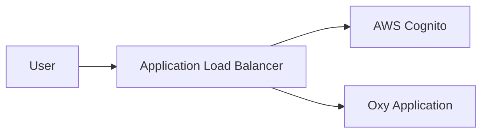

## Architecture



Please note that we only support the ALB-based authentication mode for AWS Cognito.
Oxy does not support direct integration with Cognito User Pools or hosted UI.
Oxy expects these headers from ALB:
- `x-amzn-oidc-accesstoken`
- `x-amzn-oidc-identity`
- `x-amzn-oidc-data`

as noted in Amazon's [official documentation](https://docs.aws.amazon.com/elasticloadbalancing/latest/application/listener-authenticate-users.html)

**Command**: `oxy serve --auth-mode cognito`

## Quick Setup

### 1. Create Cognito User Pool

```bash
# Create user pool
USER_POOL_ID=$(aws cognito-idp create-user-pool \
  --pool-name oxy-users \
  --auto-verified-attributes email \
  --username-attributes email \
  --query 'UserPool.Id' --output text)

# Create client
CLIENT_ID=$(aws cognito-idp create-user-pool-client \
  --user-pool-id $USER_POOL_ID \
  --client-name oxy-alb-client \
  --generate-secret \
  --callback-urls "https://your-domain.com/oauth2/idpresponse" \
  --allowed-o-auth-flows code \
  --allowed-o-auth-scopes openid email profile \
  --query 'UserPoolClient.ClientId' --output text)

# Create domain
aws cognito-idp create-user-pool-domain \
  --domain oxy-auth-$(date +%s) \
  --user-pool-id $USER_POOL_ID
```

### 2. Create Application Load Balancer

```bash
# Create ALB (assumes VPC/subnets exist)
ALB_ARN=$(aws elbv2 create-load-balancer \
  --name oxy-cognito-alb \
  --subnets subnet-xxx subnet-yyy \
  --security-groups sg-xxx \
  --scheme internet-facing \
  --query 'LoadBalancers[0].LoadBalancerArn' --output text)

# Create target group
TG_ARN=$(aws elbv2 create-target-group \
  --name oxy-cognito-tg \
  --protocol HTTP \
  --port 3000 \
  --vpc-id vpc-xxx \
  --health-check-path /health \
  --query 'TargetGroups[0].TargetGroupArn' --output text)
```

### 3. Configure ALB Listener with Cognito

```bash
ACCOUNT_ID=$(aws sts get-caller-identity --query Account --output text)

# Create HTTPS listener with Cognito auth
aws elbv2 create-listener \
  --load-balancer-arn $ALB_ARN \
  --protocol HTTPS \
  --port 443 \
  --certificates CertificateArn=arn:aws:acm:region:account:certificate/cert-id \
  --default-actions Type=authenticate-cognito,AuthenticateCognitoConfig='{
    "UserPoolArn":"arn:aws:cognito-idp:region:'$ACCOUNT_ID':userpool/'$USER_POOL_ID'",
    "UserPoolClientId":"'$CLIENT_ID'",
    "UserPoolDomain":"your-cognito-domain"
  }',Type=forward,TargetGroupArn=$TG_ARN
```

### 4. Start Oxy Application

```bash
# Start with Cognito mode
oxy serve --auth-mode cognito --port 3000

# Register instance with target group
aws elbv2 register-targets \
  --target-group-arn $TG_ARN \
  --targets Id=i-instanceid,Port=3000
```

## Social Identity Providers

### Google Integration

```bash
# Add Google as identity provider
aws cognito-idp create-identity-provider \
  --user-pool-id $USER_POOL_ID \
  --provider-name Google \
  --provider-type Google \
  --provider-details '{
    "client_id":"your-google-client-id",
    "client_secret":"your-google-client-secret",
    "authorize_scopes":"email openid profile"
  }'

# Update client to support Google
aws cognito-idp update-user-pool-client \
  --user-pool-id $USER_POOL_ID \
  --client-id $CLIENT_ID \
  --supported-identity-providers COGNITO,Google
```

For more advanced setups, refer to the AWS Cognito documentation.