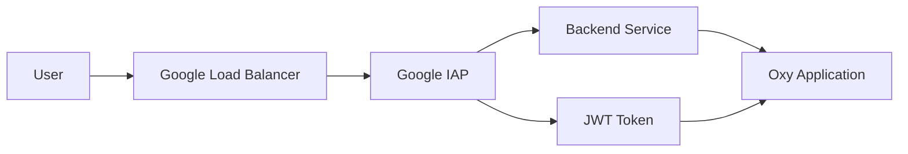
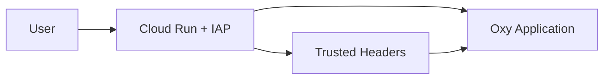

# Google IAP Authentication

Google Identity-Aware Proxy provides two distinct authentication modes for different deployment scenarios.

## Authentication Modes

### Classic IAP (`iap`)
**Command**: `oxy serve --auth-mode iap`

- **For**: Compute Engine, GKE, App Engine with load balancers
- **Authentication**: Full JWT token validation with Google's public keys
- **Headers**: `X-Goog-IAP-JWT-Assertion` (JWT token)
- **Security**: High - cryptographic verification of all requests

### Cloud Run IAP (`iap-cloud-run`) 
**Command**: `oxy serve --auth-mode iap-cloud-run`

- **For**: Cloud Run services with direct IAP integration
- **Authentication**: Trusted header-based (no JWT verification)
- **Headers**: `X-Goog-Authenticated-User-Email`, `X-Goog-Authenticated-User-ID`
- **Security**: Relies on Google Cloud Run's secure infrastructure

> **Important**: Cloud Run IAP mode trusts Google's authentication headers directly and does not perform JWT token verification, as the Cloud Run environment guarantees these headers are authentic.

## Architecture Comparison

### Classic IAP Architecture


### Cloud Run IAP Architecture


## Deployment Guide

Choose your deployment method based on your infrastructure:

### Option A: Classic IAP (with Load Balancer)

#### 1. Enable APIs

```bash
# Enable required APIs for Classic IAP
gcloud services enable iap.googleapis.com
gcloud services enable compute.googleapis.com
gcloud services enable cloudbuild.googleapis.com
```

#### 2. Create Compute Instance

```bash
# Create instance with Oxy
gcloud compute instances create oxy-instance \
    --machine-type=e2-standard-2 \
    --image-family=ubuntu-2004-lts \
    --image-project=ubuntu-os-cloud \
    --tags=oxy-app,http-server \
    --metadata=startup-script='#!/bin/bash
curl --proto="=https" --tlsv1.2 -LsSf https://internal.oxy.tech | bash
/usr/local/bin/oxy serve --auth-mode iap --port 8080'
```

#### 3. Setup Load Balancer & Backend

```bash
# Create health check
gcloud compute health-checks create http oxy-health-check \
    --port=8080 \
    --request-path=/health

# Create backend service
gcloud compute backend-services create oxy-backend \
    --protocol=HTTP \
    --health-checks=oxy-health-check \
    --global

# Create instance group and add to backend
gcloud compute instance-groups unmanaged create oxy-ig \
    --zone=us-central1-a

gcloud compute instance-groups unmanaged add-instances oxy-ig \
    --instances=oxy-instance \
    --zone=us-central1-a

gcloud compute backend-services add-backend oxy-backend \
    --instance-group=oxy-ig \
    --instance-group-zone=us-central1-a \
    --global
```

#### 4. Create OAuth & Enable IAP

```bash
# Create OAuth brand
gcloud iap oauth-brands create \
    --application_title="Oxy Application" \
    --support_email="support@yourdomain.com"

BRAND_NAME=$(gcloud iap oauth-brands list --format="value(name)")

# Create OAuth client
gcloud iap oauth-clients create $BRAND_NAME \
    --display_name="Oxy IAP Client"

# Enable IAP for backend service
gcloud iap web enable --resource-type=backend-services \
    --service=oxy-backend
```

---

### Option B: Cloud Run IAP (Simplified)

#### 1. Enable APIs

```bash
# Enable required APIs for Cloud Run IAP
gcloud services enable iap.googleapis.com
gcloud services enable run.googleapis.com
gcloud services enable cloudbuild.googleapis.com
```

#### 2. Create OAuth Consent Screen

```bash
# Create OAuth brand (first time only)
gcloud iap oauth-brands create \
    --application_title="Oxy Application" \
    --support_email="support@yourdomain.com"

# Get brand name
BRAND_NAME=$(gcloud iap oauth-brands list --format="value(name)")

# Create OAuth client
gcloud iap oauth-clients create $BRAND_NAME \
    --display_name="Oxy IAP Client"
```

#### 3. Deploy to Cloud Run

Create a `Dockerfile`:

```dockerfile
FROM ubuntu:22.04

RUN apt-get update && apt-get install -y curl
RUN curl --proto='=https' --tlsv1.2 -LsSf https://internal.oxy.tech | bash

WORKDIR /app
COPY config.yml .

EXPOSE 8080
ENV PORT=8080

CMD ["/usr/local/bin/oxy", "serve", "--auth-mode", "iap-cloud-run", "--config", "config.yml", "--port", "8080"]
```

Deploy the service:

```bash
# Set project
PROJECT_ID=$(gcloud config get-value project)

# Build and deploy
gcloud run deploy oxy-service \
    --source . \
    --platform=managed \
    --region=us-central1 \
    --no-allow-unauthenticated \
    --port=8080 \
    --memory=1Gi \
    --execution-environment=gen2
```

#### 4. Enable IAP

```bash
# Enable IAP for the Cloud Run service
gcloud iap web enable --resource-type=cloud-run \
    --service=oxy-service \
    --region=us-central1
```
## Configure Access (Both Modes)

```bash
PROJECT_ID=$(gcloud config get-value project)

# Grant access to specific users
gcloud projects add-iam-policy-binding $PROJECT_ID \
    --member=user:admin@yourdomain.com \
    --role=roles/iap.httpsResourceAccessor

# Grant access to entire domain
gcloud projects add-iam-policy-binding $PROJECT_ID \
    --member=domain:yourdomain.com \
    --role=roles/iap.httpsResourceAccessor

# Grant access to Google Groups
gcloud projects add-iam-policy-binding $PROJECT_ID \
    --member=group:oxy-users@yourdomain.com \
    --role=roles/iap.httpsResourceAccessor
```

## Authentication Headers

### Classic IAP Headers
Oxy validates JWT tokens and receives:

- **`X-Goog-IAP-JWT-Assertion`**: JWT token (validated cryptographically)
- Additional claims extracted from JWT: email, sub, etc.

```rust
// From the code: Full JWT validation
let token = self.extract_token(header)?;
self.validate(&token) // Cryptographic validation with Google's public keys
```

### Cloud Run IAP Headers  
Oxy trusts Google-provided headers **without JWT verification**:

- **`X-Goog-Authenticated-User-ID`**: User ID (format: `accounts.google.com:123456789`)
- **`X-Goog-Authenticated-User-Email`**: User email (format: `accounts.google.com:user@domain.com`)

```rust
// From the code: Header-only authentication
tracing::info!("Running in Cloud Run, skipping JWT validation");
let sub = header.get(GCP_IAP_SUB_HEADER_KEY)...
let email = header.get(GCP_IAP_EMAIL_HEADER_KEY)...
// No JWT validation - trusts Cloud Run environment
```

> **Security Note**: Cloud Run IAP mode relies on Google Cloud Run's infrastructure security to ensure these headers are authentic. The application does not perform cryptographic JWT validation.

## User Management

### Add/Remove Users

```bash
# Add individual user
gcloud projects add-iam-policy-binding $PROJECT_ID \
    --member=user:newuser@yourdomain.com \
    --role=roles/iap.httpsResourceAccessor

# Remove user access
gcloud projects remove-iam-policy-binding $PROJECT_ID \
    --member=user:olduser@yourdomain.com \
    --role=roles/iap.httpsResourceAccessor

# List current users with access
gcloud projects get-iam-policy $PROJECT_ID \
    --filter="bindings.role:roles/iap.httpsResourceAccessor"
```

### Organize with Groups

```bash
# Create group-based access (recommended)
gcloud projects add-iam-policy-binding $PROJECT_ID \
    --member=group:data-team@yourdomain.com \
    --role=roles/iap.httpsResourceAccessor

gcloud projects add-iam-policy-binding $PROJECT_ID \
    --member=group:analysts@yourdomain.com \
    --role=roles/iap.httpsResourceAccessor
```
## Troubleshooting

### Common Issues

#### Can't Access Application
```bash
# Check if you have IAP access
gcloud projects get-iam-policy $PROJECT_ID \
    --filter="bindings.members:user:your-email@domain.com"

# Verify IAP is enabled
gcloud iap web get-iam-policy --resource-type=cloud-run \
    --service=oxy-service --region=us-central1
```

#### Service Not Found
```bash
# Check Cloud Run service status
gcloud run services list --region=us-central1

# Check service logs
gcloud logs read "resource.type=cloud_run_revision AND resource.labels.service_name=oxy-service" \
    --limit=20
```

#### Permission Denied
```bash
# Add yourself to IAP access
gcloud projects add-iam-policy-binding $PROJECT_ID \
    --member=user:$(gcloud config get-value account) \
    --role=roles/iap.httpsResourceAccessor
```

## Cost Estimate

- **Cloud Run**: ~$0.18/million requests + CPU/memory usage
- **IAP**: Free for first 100 users, then $0.011/user/month
- **Total**: Typically $5-20/month for small teams

## Next Steps

- [Built-in Authentication](./built-in) - Self-hosted alternative
- [AWS Cognito](./cognito) - AWS enterprise integration  
- [Authentication Overview](./overview) - Compare all modes

## Mode Comparison

| Feature | Classic IAP | Cloud Run IAP |
|---------|-------------|---------------|
| **Command** | `--auth-mode iap` | `--auth-mode iap-cloud-run` |
| **Infrastructure** | Load Balancer + Backend | Cloud Run Direct |
| **Authentication** | JWT Token Validation | Trusted Headers |
| **Security Level** | High (Cryptographic) | High (Infrastructure) |
| **Setup Complexity** | High | Low |
| **JWT Verification** | ✅ Yes | ❌ No (trusts headers) |
| **Best For** | Multi-service, Complex | Single service, Simple |

## Get Your URLs

### Classic IAP
```bash
# Get load balancer IP
gcloud compute forwarding-rules list --global
```

### Cloud Run IAP
```bash
# Get the Cloud Run service URL
gcloud run services describe oxy-service \
    --region=us-central1 \
    --format="value(status.url)"
```
