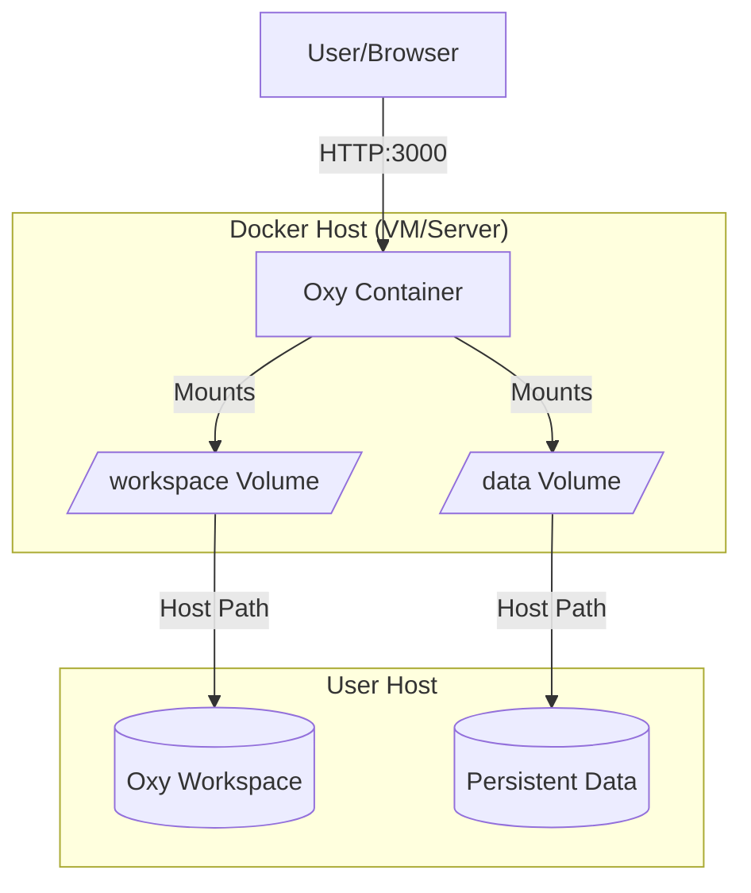

This guide explains how to deploy Oxy using Docker containers, providing an alternative to the traditional server-based deployment approach.

<Note>
  Using Docker simplifies the deployment process and environment setup, making it easier to run Oxy in a consistent environment across different platforms.
</Note>

## Prerequisites

Before you start, ensure you have:

- Docker installed on your host system
- An Oxy workspace with your configuration files, agents, and workflows
- Required API keys and environment variables for your deployment

<Tip>
  We recommend your Docker host machine have a minimum of 4GB RAM for optimal performance of Oxy and related services.
</Tip>

## Quick Start

The fastest way to get started with Oxy on Docker is to use the pre-built image from GitHub Packages:

```bash
# Pull the latest Oxy Docker image
docker pull ghcr.io/oxy-hq/oxy:0.2.3

# Run Oxy with a mounted workspace
docker run -d \
  --name oxy-instance \
  -p 3000:3000 \
  -v /path/to/your/workspace:/app \
  -e OPENAI_API_KEY=your-api-key \
  -e OXY_STATE_DIR=/app \
  ghcr.io/oxy-hq/oxy:0.2.3
```

## Why Use Docker Compose?

Docker Compose lets you define and manage multi-container applications with a single YAML file. For Oxy, Compose makes it easy to:

- Start Oxy and related services (like databases or proxies) with one command
- Configure environment variables, volumes, and ports in one place
- Ensure all containers are networked and started in the right order
- Reproduce your deployment setup easily across machines or teams

**In short:** Docker Compose simplifies running Oxy in production or development, especially when you need more than one container.

## Reference Architecture Diagram



## Detailed Deployment Steps

<Steps>
  <Step title="Prepare Your Workspace">
    Before deploying, ensure you have an Oxy workspace ready with your configuration files. Your workspace directory should typically include:
    
    - `config.yml` - Main configuration file
    - Your agent definitions (`.agent.yml` files)
    - Your workflow definitions (`.workflow.yml` files)
    - Any other resources your agents and workflows need

    ```bash
    # Example workspace structure
    workspace/
    ├── config.yml
    ├── my-agent.agent.yml
    ├── my-workflow.workflow.yml
    └── resources/
        └── data.json
    ```
  </Step>

  <Step title="Create a Docker Compose File">
    For easier management, create a `docker-compose.yml` file:

    ```yaml
    version: '3'
    services:
      oxy:
        image: ghcr.io/oxy-hq/oxy:0.2.3
        container_name: oxy-instance
        ports:
          - "3000:3000"
        working_dir: /workspace
        volumes:
          - ./workspace:/workspace
          - ./oxy-data:/data
        environment:
          - OPENAI_API_KEY=your-openai-api-key
          - OXY_STATE_DIR=/data
        restart: unless-stopped
        command: ["oxy", "serve", "--host", "0.0.0.0", "--port", "3000"]
    ```
    
    <Warning>
      Replace `your-openai-api-key` with your actual OpenAI API key. For production deployments, consider using Docker secrets or environment files to avoid storing sensitive data in your compose file.
    </Warning>
  </Step>

  <Step title="Start the Container">
    Launch your Oxy container:

    ```bash
    docker-compose up -d
    ```

    By default, the container's working directory is `/app`. If you want to use `/workspace` as your working directory (as in the example above), make sure to set `working_dir: /workspace` in your Docker Compose file and mount your workspace to `/workspace`.

    Your Oxy instance will be available at `http://localhost:3000` once the container starts.
  </Step>
</Steps>

## Volume Mounting Explained

When running Oxy in Docker, you'll typically need to mount two types of directories:

1. **Workspace Mount**: Maps your local Oxy workspace to the container
   ```
   -v /path/to/your/workspace:/workspace
   ```
   This allows Oxy to access your configuration, agents, and workflows.

2. **Data Mount**: Provides persistent storage for Oxy's state
   ```
   -v /path/to/persistent/data:/data
   ```
   This ensures your data is preserved even if the container is restarted.

## Data Persistence

Oxy uses SQLite for data storage by default, which means proper volume mounting is essential for maintaining your data across container restarts or updates.

### Storage Location

- By default, Oxy stores its data in `~/.local/share/oxy/` on the host system
- When using Docker, you should explicitly set the `OXY_STATE_DIR` environment variable (typically to `/data`) and mount a volume to that location

### What Data Is Stored

Oxy stores several types of data that need to be persisted:

- SQLite database files containing state information
- Semantic information from synchronized databases
- Cached query results and intermediate data
- Workflow execution history and checkpoints

### Example Docker Setup with Proper Data Persistence

```yaml
version: '3'
services:
  oxy:
    image: ghcr.io/oxy-hq/oxy:0.2.3
    container_name: oxy-instance
    ports:
      - "3000:3000"
    working_dir: /workspace
    volumes:
      - ./workspace:/workspace
      - ./oxy-data:/data  # Essential for data persistence
    environment:
      - OPENAI_API_KEY=your-openai-api-key
      - OXY_STATE_DIR=/data  # Points to the mounted volume
    restart: unless-stopped
    command: ["oxy", "serve", "--host", "0.0.0.0", "--port", "3000"]
```

<Warning>
  For production deployments, ensure your data volume is backed by reliable storage. In cloud environments, consider using:
  - Amazon EBS volumes (AWS)
  - Persistent Disks (Google Cloud)
  - Azure Disk Storage
  - Network-attached storage (NAS) for multi-node setups
</Warning>

<Note>
  When using Docker Compose, your data will persist as long as you don't remove the volumes. Use `docker-compose down -v` with caution as it will delete the volumes.
</Note>

## Environment Variables

Common environment variables to configure in your Oxy container:

| Variable | Description | Example |
|----------|-------------|---------|
| `OPENAI_API_KEY` | Your OpenAI API key | `sk-...` |
| `OXY_STATE_DIR` | Directory for Oxy state persistence | `/data` |
| `DATABASE_URL` | Connection URL if using a database | `postgres://...` |
| `PORT` | Override the default port | `8080` |

## Advanced Configuration

### Custom Docker Images

If you need to extend the official Oxy image with additional dependencies or configuration, you can create your own Dockerfile:

```dockerfile
FROM ghcr.io/oxy-hq/oxy:0.2.3

# Add custom dependencies
RUN apt-get update && apt-get install -y your-package

# Add custom files
COPY ./custom-config.yml /default-config.yml

# Override the default command if needed
CMD ["oxy", "serve", "--config", "/default-config.yml"]
```

### Health Checks

Add health checks to ensure your container is running properly:

```yaml
services:
  oxy:
    # ...existing configuration...
    healthcheck:
      test: ["CMD", "curl", "-f", "http://localhost:3000"]
      interval: 30s
      timeout: 10s
      retries: 3
      start_period: 40s
```

## Troubleshooting
<Note>
For further help or to ask questions, join our community on [Discord](https://discord.gg/m677N4EcRK).
</Note>

## Next Steps

Once your Docker deployment is up and running, you can:

- Set up CI/CD pipelines to automatically update your Oxy instance
- Implement monitoring and logging solutions
- Configure backups for your persistent data
- Scale horizontally for higher availability

For more information on using Oxy, refer to the [main documentation](/welcome).
