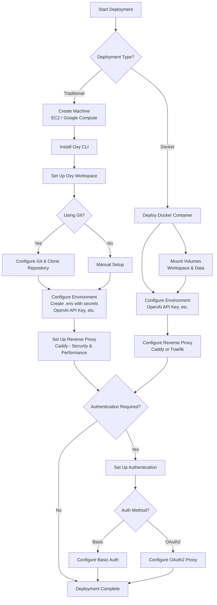
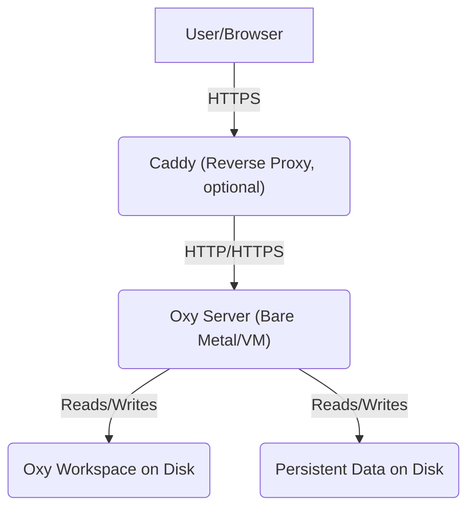

This guide walks you through deploying Oxy on a cloud environment, from provisioning infrastructure to configuring authentication.

<Note>
  The product currently doesn't include built-in authentication and requires some technical setup, especially to work with your own files and configuration. It's best suited for teams comfortable with a bit of customization and who want flexibility in how they deploy and integrate with existing systems.

  We're working on improving automation and usability, and are happy to help with setup—feel free to reach out via Discord or any support channel.
</Note>

<Tip>
  **Quick Start with Docker:** If you prefer a faster deployment option, you can use our [Docker deployment](/deployment/docker) method instead of the traditional setup. Docker provides a more streamlined experience with fewer manual steps.
</Tip>

## Deployment Paths

There are two main approaches to deploying Oxy:

1. **Traditional Linux Setup** - Follow the step-by-step guide below to provision a machine, install dependencies, and configure each component manually.
2. **Docker Deployment** - Use our [Docker image](https://github.com/oxy-hq/oxy/pkgs/container/oxy) for a containerized deployment that simplifies setup and maintenance. See the [Docker deployment guide](/deployment/docker) for details.

## Deployment Overview



## Reference Architecture Diagram



## Deployment Steps

Follow these steps to deploy Oxy on your cloud environment:

<CardGroup cols={2}>
  <Card
    title="1. Create Machine"
    icon="server"
    href="/deployment/create-machine"
  >
    Provision and set up your server with the necessary requirements
  </Card>
  <Card
    title="2. Install Oxy CLI"
    icon="terminal"
    href="/deployment/install-oxy"
  >
    Install and configure the Oxy CLI on your server
  </Card>
  <Card
    title="3. Set Up Workspace & Repository"
    icon="folder-tree"
    href="/deployment/workspace-setup"
  >
    Set up your Oxy workspace and configure your repository
  </Card>
  <Card
    title="4. Configure Environment"
    icon="gear"
    href="/deployment/environment"
  >
    Set up environment variables and secrets management
  </Card>
  <Card
    title="5. Set Up Reverse Proxy"
    icon="shield-halved"
    href="/deployment/reverse-proxy"
  >
    Configure Caddy as a reverse proxy for HTTPS, security, and performance
  </Card>
  <Card
    title="6. Set Up Authentication"
    icon="lock"
    href="/deployment/authentication"
  >
    Configure authentication using Basic Auth or OAuth2
  </Card>
  <Card
    title="Docker Deployment"
    icon="docker"
    href="/deployment/docker"
  >
    Deploy Oxy using Docker containers for simplified setup and management
  </Card>
</CardGroup>

## Troubleshooting
<Note>
For further help or to ask questions, join our community on [Discord](https://discord.gg/m677N4EcRK).
</Note>

## Quick One-Time Script

If you prefer to set up everything with a single script, you can use the following bash script that automates the entire deployment process. Customize the variables at the beginning to fit your requirements:

```bash
#!/bin/bash
# Oxy Cloud Deployment Script

# ===== CONFIGURATION =====
# Change these variables to match your setup
DOMAIN_NAME="your-domain.com"
WORKSPACE_DIR="/home/ubuntu/oxy-workspace"
GIT_REPO="git@github.com:your-org/your-oxy-repo.git"
USE_GIT=true
EMAIL="admin@yourdomain.com"
OPENAI_API_KEY="your-openai-api-key"
USE_AUTH=true
AUTH_METHOD="basic" # "basic" or "oauth2"
AUTH_USERNAME="admin"
AUTH_PASSWORD="secure-password"

# ===== STEP 1: Create Machine =====
echo "===== 1. Setting up server ====="
sudo apt-get update -y
sudo apt-get install -y \
    git \
    curl \
    wget \
    unzip \
    tar \
    gcc \
    g++ \
    make \
    python3-pip \
    ufw \
    software-properties-common

# Configure SSH
mkdir -p ~/.ssh
chmod 700 ~/.ssh
touch ~/.ssh/authorized_keys
chmod 600 ~/.ssh/authorized_keys

# Configure Firewall
sudo ufw allow 22/tcp
sudo ufw allow 80/tcp
sudo ufw allow 443/tcp
sudo ufw --force enable

# ===== STEP 2: Install Oxy CLI =====
echo "===== 2. Installing Oxy CLI ====="
bash <(curl --proto '=https' --tlsv1.2 -sSf https://raw.githubusercontent.com/oxy-hq/oxy/refs/heads/main/install_oxy.sh)

# Set up Oxy system service
cat <<EOF | sudo tee /etc/systemd/system/oxy.service
[Unit]
Description=Oxy server
After=network.target

[Service]
User=$(whoami)
WorkingDirectory=${WORKSPACE_DIR}
ExecStart=/bin/bash -c "/usr/local/bin/oxy serve & /usr/local/bin/oxy mcp-sse"
Restart=always
Environment="OXY_STATE_DIR=${HOME}/oxy_data"

[Install]
WantedBy=multi-user.target
EOF

# ===== STEP 3: Set Up Workspace & Repository =====
echo "===== 3. Setting up workspace ====="
mkdir -p ${WORKSPACE_DIR}
cd ${WORKSPACE_DIR}

if [ "$USE_GIT" = true ]; then
    # Set up SSH for Git
    if [ ! -f ~/.ssh/id_ed25519 ]; then
        ssh-keygen -t ed25519 -C "$EMAIL" -f ~/.ssh/id_ed25519 -N ""
        ssh-keyscan -t rsa github.com >> ~/.ssh/known_hosts
        echo "Add this SSH key to your Git provider:"
        cat ~/.ssh/id_ed25519.pub
        echo "Press Enter when done..."
        read
    fi
    # Clone repository
    git clone ${GIT_REPO} .
else
    echo "Manual workspace setup. Place your files in ${WORKSPACE_DIR}"
    touch config.yml
    echo "basic: true" > config.yml
fi

# ===== STEP 4: Configure Environment =====
echo "===== 4. Setting up environment ====="
touch .env
chmod 600 .env
echo "OPENAI_API_KEY=${OPENAI_API_KEY}" > .env

# ===== STEP 5: Set Up Reverse Proxy =====
echo "===== 5. Setting up Caddy reverse proxy ====="
sudo apt install -y debian-keyring debian-archive-keyring apt-transport-https curl
curl -1sLf 'https://dl.cloudsmith.io/public/caddy/stable/gpg.key' | sudo gpg --dearmor -o /usr/share/keyrings/caddy-stable-archive-keyring.gpg
curl -1sLf 'https://dl.cloudsmith.io/public/caddy/stable/debian.deb.txt' | sudo tee /etc/apt/sources.list.d/caddy-stable.list
sudo apt update -y
sudo apt install -y caddy

# ===== STEP 6: Configure Authentication =====
echo "===== 6. Setting up authentication ====="

if [ "$USE_AUTH" = true ]; then
    if [ "$AUTH_METHOD" = "basic" ]; then
        # Generate password hash
        PASSWORD_HASH=$(caddy hash-password --plaintext ${AUTH_PASSWORD})
        # Create Caddyfile with basic auth
        cat <<EOF | sudo tee /etc/caddy/Caddyfile
${DOMAIN_NAME} {
    basicauth {
        ${AUTH_USERNAME} ${PASSWORD_HASH}
    }
    reverse_proxy localhost:8080
}
EOF
    else
        # Install OAuth2 Proxy
        OAUTH2_PROXY_VERSION="v7.8.2"
        ARCH="linux-arm64"
        wget "https://github.com/oauth2-proxy/oauth2-proxy/releases/download/${OAUTH2_PROXY_VERSION}/oauth2-proxy-${OAUTH2_PROXY_VERSION}.${ARCH}.tar.gz"
        tar -xzf "oauth2-proxy-${OAUTH2_PROXY_VERSION}.${ARCH}.tar.gz"
        sudo mv "oauth2-proxy-${OAUTH2_PROXY_VERSION}.${ARCH}/oauth2-proxy" /usr/local/bin/oauth2-proxy
        sudo chmod +x /usr/local/bin/oauth2-proxy
        rm -rf "oauth2-proxy-${OAUTH2_PROXY_VERSION}.${ARCH}"*
        echo "OAuth2 setup requires manual configuration. Follow the documentation for detailed steps."
    fi
else
    # Create simple Caddyfile without auth
    cat <<EOF | sudo tee /etc/caddy/Caddyfile
${DOMAIN_NAME} {
    reverse_proxy localhost:8080
}
EOF
fi

# ===== Start Services =====
echo "===== Starting services ====="
sudo systemctl daemon-reload
sudo systemctl enable oxy
sudo systemctl start oxy
sudo systemctl enable caddy
sudo systemctl start caddy

echo "===== Deployment Complete ====="
echo "Your Oxy instance should now be available at: https://${DOMAIN_NAME}"
echo "Remember to update configuration variables in .env and restart the service if needed."
```

<Warning>
  This script is provided as a starting point and may need adjustments for your specific environment. Always review scripts before running them on your server.o "Your Oxy instance should now be available at: https://$\{DOMAIN_NAME\}"
  echo "Remember to update configuration variables in .env and restart the service if needed."
</Warning>

To use the script:
1. Save it to a file (e.g., `deploy-oxy.sh`)
2. Make it executable: `chmod +x deploy-oxy.sh`  This script is provided as a starting point and may need adjustments for your specific environment. Always review scripts before running them on your server.
3. Edit the configuration variables at the beginning of the script
4. Run the script: `./deploy-oxy.sh`
