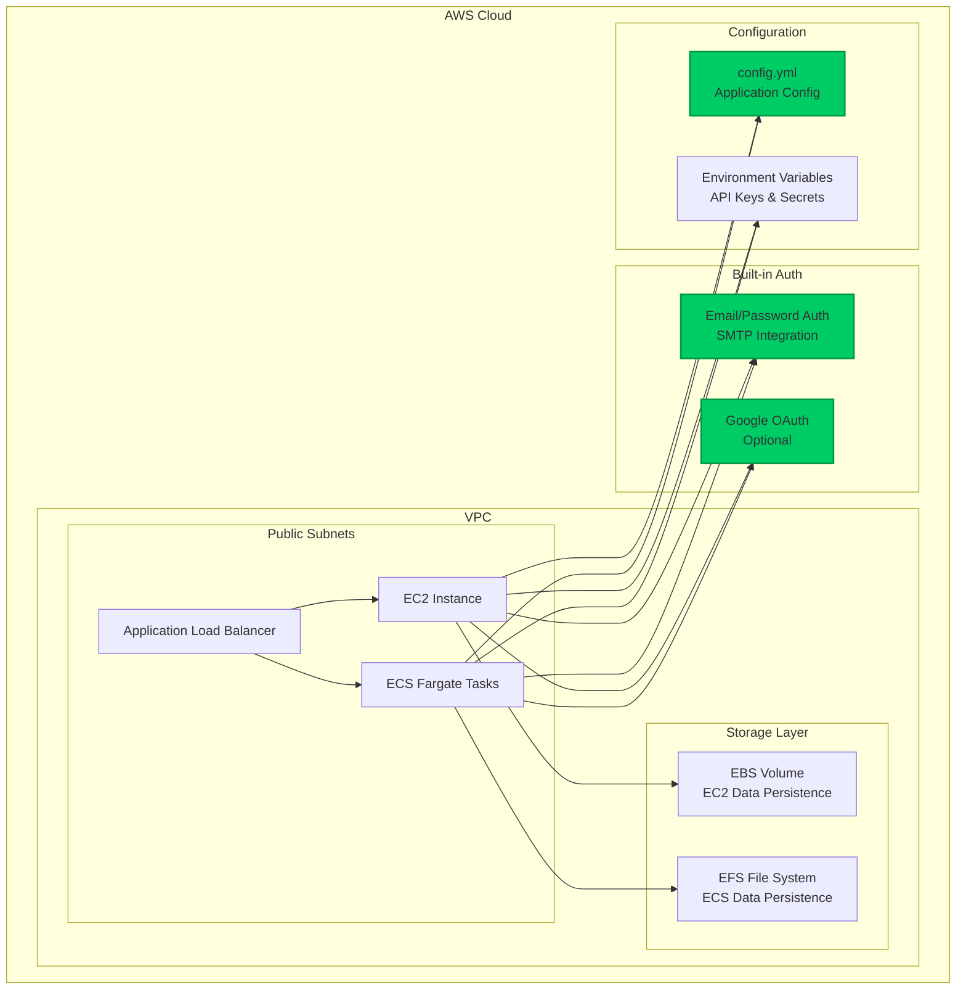
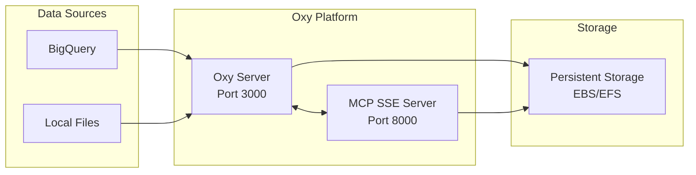

This document provides an architectural overview of the Oxy deployment options using AWS infrastructure. We support two primary deployment patterns: EC2-based and ECS-based deployments.

## High-Level Architecture

## Deployment Architecture Options

Oxy supports two primary AWS deployment patterns, each optimized for different use cases:

### [EC2 Deployment](./ec2-architecture)
Direct virtual machine deployment offering simplicity and full control.
- **Best for**: Development, small teams, direct server control
- **Key benefits**: Simple setup, SSH access, cost-effective for steady workloads
- **Architecture**: Single instance with EBS storage

### [ECS Deployment](./ecs-architecture)
Container-based deployment with automatic scaling and high availability.
- **Best for**: Production environments, scalable applications, enterprise deployments
- **Key benefits**: Auto-scaling, multi-AZ availability, managed infrastructure
- **Architecture**: Fargate containers with EFS shared storage

## Common Components

## Deployment Comparison

| Feature | EC2 Deployment | ECS Deployment |
|---------|---------------|----------------|
| **Complexity** | Low | Medium |
| **Scalability** | Manual | Automatic |
| **Availability** | Single AZ | Multi-AZ |
| **Storage** | EBS (10GB) | EFS (Shared) |
| **Cost** | Fixed instance cost | Pay per use |
| **Maintenance** | Manual updates | Managed by AWS |
| **Debugging** | SSH access | CloudWatch logs |
| **Ideal for** | Development, Small teams | Production, Large teams |

## Next Steps

Choose your deployment architecture:

### ECS Deployment  
- [ECS Architecture Details](./ecs-architecture) - Detailed ECS deployment architecture
- [ECS Setup Guide](./step-by-step/ecs) - Step-by-step container deployment guide
