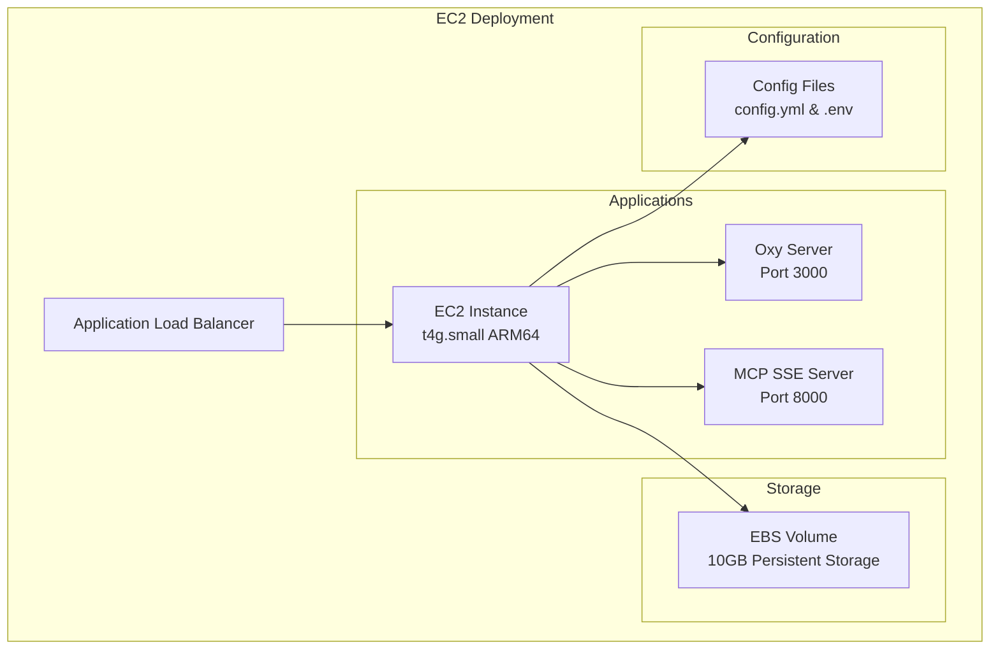

## EC2 Deployment Architecture

## Architecture Components

### Core Infrastructure
- **EC2 Instance**: ARM64 instance (t4g.small recommended)
- **Application Load Balancer**: Traffic routing and SSL termination
- **EBS Volume**: 10GB persistent storage
- **Security Groups**: Network access control

### Application Stack
- **Oxy Server**: Main application (port 3000)
- **MCP SSE Server**: Model Context Protocol server (port 8000)
- **Configuration**: Files via `config.yml` and environment variables

## Infrastructure Specifications

| Workload Size | Instance Type | vCPU | Memory | Storage | Monthly Cost* |
|---------------|---------------|------|--------|---------|---------------|
| **Small** | t4g.small | 2 | 2 GB | 10GB EBS | ~$15 |
| **Medium** | t4g.medium | 2 | 4 GB | 20GB EBS | ~$30 |
| **Large** | t4g.large | 2 | 8 GB | 50GB EBS | ~$60 |

*Approximate costs in us-east-1 region

## Key Benefits & Considerations

### ✅ Advantages
- **Simple setup**: Direct VM deployment with full control
- **Cost-effective**: Fixed instance cost for predictable workloads  
- **SSH access**: Direct access for debugging and maintenance
- **Flexible scaling**: Easy vertical scaling by changing instance type

### ⚠️ Considerations
- **Single point of failure**: No built-in high availability
- **Manual scaling**: Requires intervention for capacity changes
- **Maintenance overhead**: OS updates and security patching required

## Next Steps

Ready to deploy? Choose your authentication method:

### Built-in Authentication (Recommended)
- [EC2 Built-in Auth Setup](./step-by-step/ec2-builtin-auth) - Quick setup with Oxy's native authentication

### AWS Cognito Authentication  
- [EC2 Cognito Setup](./step-by-step/ec2-cognito) - Enterprise setup with AWS Cognito integration

Both guides provide detailed step-by-step instructions for setting up the complete EC2 infrastructure.
