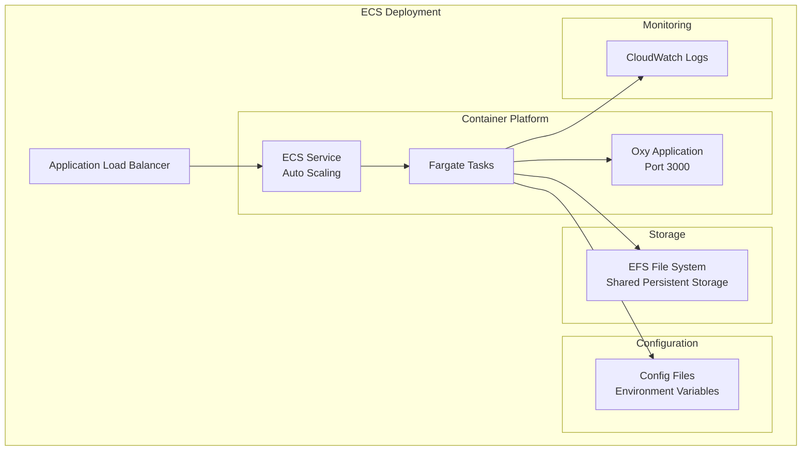

## ECS Deployment Architecture

## Architecture Components

### Container Platform
- **ECS Cluster**: Managed container orchestration
- **Fargate Tasks**: Serverless container execution
- **Auto Scaling**: Automatic scaling based on utilization
- **Application Load Balancer**: Traffic distribution across tasks

### Storage & Configuration
- **EFS File System**: Shared persistent storage across tasks
- **Environment Variables**: Runtime configuration via task definitions
- **AWS Secrets Manager**: Secure storage for sensitive data

## Infrastructure Specifications

| Workload Size | CPU | Memory | Storage | Tasks | Monthly Cost* |
|---------------|-----|--------|---------|-------|---------------|
| **Small** | 0.25 vCPU | 512 MB | 20GB EFS | 1-2 | ~$25 |
| **Medium** | 0.5 vCPU | 1024 MB | 50GB EFS | 2-4 | ~$60 |
| **Large** | 1 vCPU | 2048 MB | 100GB EFS | 3-6 | ~$150 |

*Approximate costs in us-east-1 region including EFS storage

## Key Benefits & Considerations

### ✅ Advantages
- **Auto-scaling**: Automatic horizontal scaling based on demand
- **High availability**: Multi-AZ deployment with automatic failover
- **Managed infrastructure**: AWS handles underlying infrastructure
- **Zero-downtime deployments**: Rolling updates with health checks
- **Cost optimization**: Pay-per-use pricing model

### ⚠️ Considerations
- **Complex setup**: More components than EC2 deployment
- **Cold starts**: Initial container startup time
- **Variable costs**: Pricing based on usage patterns

## Next Steps

Ready to deploy? Follow the step-by-step guide:

- [ECS Deployment Guide](./step-by-step/ecs) - Complete setup instructions for ECS with Fargate

The guide provides detailed instructions for setting up the complete ECS infrastructure.
